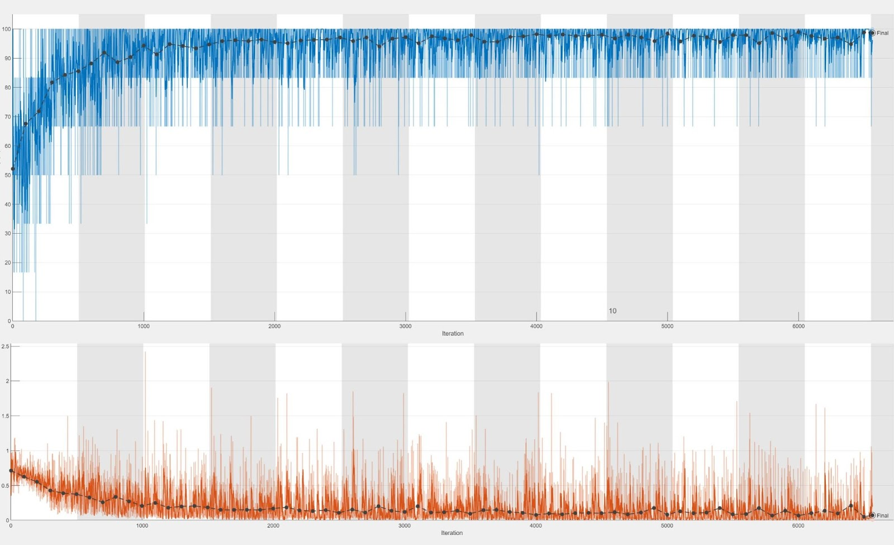

# Group 8 Final Project of Monty Matlab
Leonie Freisinger, Onat Inak, Adam Misik, Robert Jacumet

This repository tracks the work for the final project of Group 8 in the Monty Matlab course at the Technical University of Munich.
It includes all the functionalities needed to implement a Silly walk 
classifier pipeline. 

The goal is to create a model that is able to discriminate between normal 
walks and silly walks (example video for silly walks: https://www.youtube.com/watch?v=eCLp7zodUiI). 
The data needed for the model is collected using the Matlab Mobile app, which runs on both iOS and Android.

In principle, the classification model can be of any nature: machine learning based, deep learning based, Bayesian, or a simple threshold model.
However, this project focuses on feature-based classifiers and neural networks, as their high potential has been shown in [1] and [2].
The models are evaluated based on their prediction accuracy. 

In addition, a graphical user interface (GUI) is implemented, through which the main functionalities of the project are displayed.

## Environment 
Following Matlab Version and Toolboxes are needed:

- MATLAB R2019a or higher

- Deep Learning Toolbox

- Statistics and Machine Learning Toolbox

## How to run
Git clone this repository into your environment. Make sure to add all folders and subfolders to  your path. Therefore you can right-click on the downloaded repository folder and select "Add to Path" > "Seelcted Folders and Subfolders".  Run the *main.m* function to run our classificaction pipeline, from data import to the predictions. Alternatively, the *GUI/GUI_view_final.m* class can be used to test our functionalities through a graphical user interface.  

## Data 
The data used in our experiments can be found in the folders *Data*, *TrainingData* and *TestData*. 

- *Data*: includes all of the raw signal data collected by each group member. For the data acquisition the helper 
function *RecordAcce_mobile.m* was used, which ran in the Matlab Mobile App backend during the walks.
The sub-folder *Data_Total* is a data pool containing data from each member. For more information on how the data was collected, please refer to the document.

- *TrainingData*: contains the processed signal data needed to train a model specified within the function *trainSillyWalkClassifier.m*.

- *TestData*: contains the processed signal data used to evaluate the classifier model.

## Data Processing
Before the signal data from *Data_Total* could be used for the
model training, noisy windows in the beginning and end of the signal are sliced out using the *sliceData.m* helper function, and stored 
in a 80/20 split in *TrainData*/*TestData*. This procedure ensures that only periods of walking are being inspected.
The *extractData.m* function is called within *trainSillyWalkClassifier.m* to resample and slice the signals into windows specified by the sample rate
and window length parameters.

## Model
Three machine learning models were inspected within this project:

- LSTM (Long-short term memory) network: proposed in [2], LSTM's have proven to be highly efficient in the discrimination of 
normal and silly walks.  The  LSTM  model  is  a  recurrent  neural  network  and 
can exhibit  temporally  dynamic  behavior  by  using  its  memory  to process  variable  length  sequences  of  inputs.  This  model 
hast he  advantage  that  measured  time  sequences  of  acceleration data  can  be  used  directly  to  train  the  model  without  first 
extracting  features.

- kNN (k-nearest neighbor):  in  contrast to  the  LSTM  model,  specific  features  have  been  extracted for   the   kNN   approach   instead   of   taking   time sequences  as  input,  inspired  by  the  work  of  [3]  and  [4].
The selected features are: signal mean of the Z-axis, signal RMS of the X-axis, signal RMS of the Y-axis, signal RMS of the Z-axis, pearson correlation between the X- and Z-axis,
pearson correlation between the Y- and Z-axis, and the sum of magnitudes under the 25 percentile.

- SVM (Support-Vector Machines): inspired by the work proposed in [3], a SVM has been trained with the same features as used in the kNN approach.

## Evaluation
- Accuracies: LSTM 99.2%, kNN 91.6%, SVM 90.4%.
- Training run times on our *TrainingData*: LSTM 456.1s, kNN 10.11s, SVM 6.96s.

Training loss curve:

## GUI 
The user interface summarizes the presented functionalities in a class-based GUI element and can be used for testing purposes.
By running the class *GUI/GUI_view_final.m*, the user interface is opened and is ready to use. After test data and a classification model have been uploaded, 
the interface offers the user the possibility to classify either a single walk or a set of walks extracted from the loaded folder.
The classification results are displayed through a confusion matrix and a GIF, which differs based on the predicted class or majority of classes (in the case of a folder with walks).

## Work distribution
- Robert: set up the data import and processing pipeline (with the *extractData* function), and made sure that all further functions could be integrated in the *main*.

- Onat: being our first machine learning engineer, Onat intensively analyzed LSTM, has done the hyperparameter optimization for the LSTM and found our best classification model.

- Leonie: being  the second  machine learning engineer, Leonie investigated kNN and searched for the optimal features used in the model for the discrimination between silly and normal walks.

- Adam: being the UI/UX engineer, Adam set up the graphical user interface and helped in the machine learning model search and optimization.

Each team member helped in the data acquisition task. Over 200 minutes, so more than 5000 samples where collected in this process, following a strict procedure as can be found in the report, guaranteeing a high variance of walks to robustly predict Silly and Normal Walks

## References
[1] W. Sousa Lima & E. Souto &  K. El-Khatib &  R. Jalali & J. Gama. (2019). Human Activity Recognition Using Inertial Sensors in a Smartphone: An Overview. Sensors. 19. 3213. 10.3390/s19143213.
 
[2] K. Rieke. Human Activity Recognition Using A Smartphone’s Inertial Measurement Unit

[3] A. Mannini and A. M. Sabatini. On-line classification of human activity and estimation of walk-run speed from acceleration data using support vector machines. 2011 Annual International Conference of the IEEE Engineering in Medicine and Biology Society, 2011, pp. 3302-3305, doi: 10.1109/IEMBS.2011.6090896.

